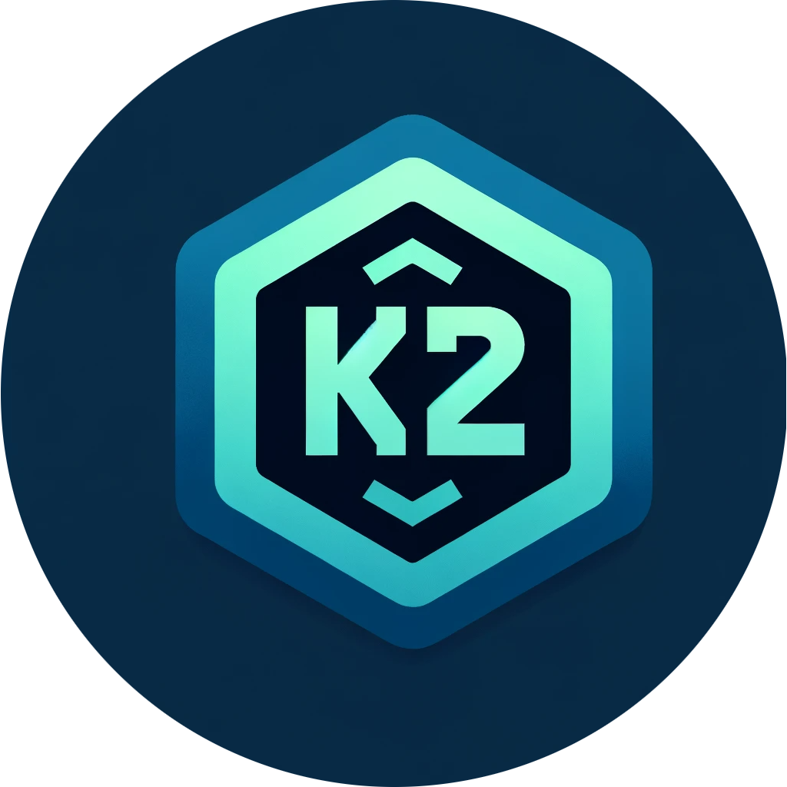
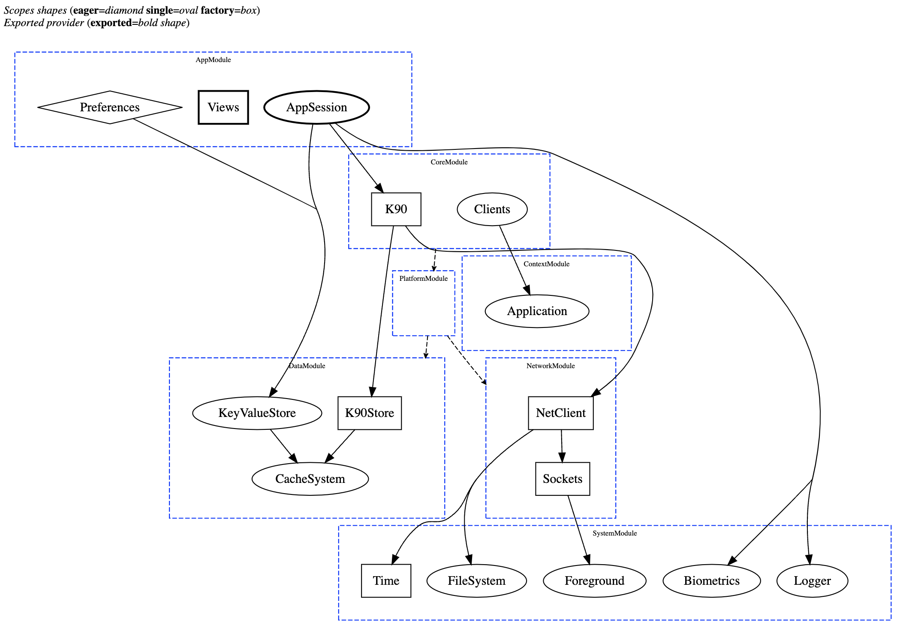

# *kInject2* (kI2)

#### A kotlin multiplatform dependency injection framework powered by [KSP](https://github.com/google/ksp) & [KotlinPoet](https://github.com/square/kotlinpoet)

<sub><sup>*kInject2 is based on kInject, a dependency injection framework for Java. The initial *k* is not because this is a Kotlin-oriented framework.</sup></sub>

---
When you model a software solution, you basically establish how a bunch of entities interact with each other.
If the entity A interacts with another entity B, we say that A has a dependency on B.
Now, if you represent all these dependency relationships in your system as a directed graph, you will get a dependency graph.

As your system evolves and grows, you quickly realize that all these relationships of dependency become a little bit complex to manage. 
Soon, concepts such as Inversion of Control, Inversion of dependency, and Dependency Injection emerge as a way to handle all that complexity.

## This is kInject2

kInject2 (kI2) is a multi-platform, compile-time dependency injection framework for Kotlin. It is designed to be easy-to-learn and easy-to-use.

### The dependency graph

The first step to use kI2 is to build a dependency graph. To do this, we annotate a class with ```@Graph```.  
This annotation will let kI2 know that we want to use this class as a dependency graph. 

```kotlin
@Graph
class MyFirstGraph
```

### Declaring dependencies

The example above represents a valid graph, but it's an empty graph, which doesn't seem to be very useful.  
Let's declare our first dependency: 

```kotlin
@Graph
class MyFirstGraph {
    fun provideNumber() = single { 8 }
}
```

This declaration adds a dependency of type ```Int``` to the graph.

*\* Graph compilation will fail if more than one declaration for a type is added to the graph.*

#### Type inference

In the dependency declaration example above, the ```Int``` type is automatically inferred.
Sometimes you may want to override the default type inference, use one of the following ways to override the inferred type:

```kotlin
fun provideNumber() = single<Number> { 8 }
```

```kotlin
fun provideNumber(): Single<Number> = single { 8 }
```

#### Scopes

Dependencies are always declared inside a scope. The scope determines when a dependency is instantiated as well as its reusability.  
kI2 provides the following scopes: 

* **Single** The single scope guarantees that only one instance of this dependency will be created in the graph instance. The dependency won't be instantiated until it is first required (lazy).  

```kotlin
fun provideSingleNumber() = single { 5 }
```

* **Eager** The eager scope also guarantees that only one instance of this dependency will be created, but the dependency will be instantiated as soon as the graph is loaded.  

```kotlin
fun provideSingleNumber() = eager { 5 }
```

* **Factory** A new instance will be returned every time a dependency with factory scope is required.

```kotlin
fun provideSingleNumber() = factory { 5 }
```

*\* The scope of a dependency only applies within the graph context and per graph instance.*

#### Type alias

You can declare a dependency type only once; otherwise, kI2 will raise an error at compilation time.  
However, there may be situations where you need to add multiple dependencies of the same type to the graph. In these cases, you can leverage `typealias` to distinguish between them. 

```kotlin
typealias Password = String

@Graph
class MyFirstGraph {
    fun provideText() = single { "This is awesome" }
    fun providePassword() = single<Password> { "Secret password" }
}
```

#### Type erasure

Type erasure, not a problem for kI2. If you declare dependencies with generics, kI2 will be able to deal with them.

```kotlin
@Graph
class MyFirstGraph {
    fun provideListOfNumbers() = single { listOf(1, 2, 3) }
    fun provideListOfStrings() = single { listOf("1", "2", "3") }
}
```

#### The dependency's dependencies

So far, we've seen how to declare a dependency, but we haven't established any connection between them.  
If you are declaring a dependency that has a dependency on other dependencies, simply add them as parameters of the function where the dependency is declared.   

```kotlin
@Graph
class MyFirstGraph {
    fun provideNumber() = single { 8 }
    fun provideText(times: Int) = single { "*".repeat(times) }
}
```

*\* kI2 will throw a compile-time error if it detects a dependency cycle, or if any of the dependencies are unknown.*  
*\* All declared dependencies must either serve as a dependency for other dependencies and/or be exported ([see export section below](#exporting-dependencies)), otherwise, a compile-time error will be thrown.*

#### Optional types

You can declare optional (nullable) dependencies; however, be aware of the following constraints:
1. A type and its optional variant are considered the same type.
2. If a dependency relies on an optional dependency, the optional nature must be respected in its declaration.

```kotlin
@Graph
class MyFirstGraph {
    fun provideNonOptionalText() = single { "Text" }
    fun provideOptionalNumber() = single<Int?> { null }
    fun provideTextAndNumber(text: String?, number: Int?) = single {
        // text will be supplied by the first declaration as a non-optional type can resolve optional
        // number will be supplied by the second declaration, compilation fails if number isn't marked as optional
        OptionalTextAndNumber(text = text, number = number)
    }
}
data class OptionalTextAndNumber(val text: String?, val number: Int?)
```

*\* A non-optional declaration can resolve both, optional and non-optional dependencies.*

#### Function type

Functions are treated like any other type, allowing you to declare a dependency that provides a function as its return type. 

```kotlin
@Graph
class MyFirstGraph {
    fun provideSymbol() = single { '*' }
    fun provideText(symbol: Char) = single { times: Int -> symbol.toString().repeat(times) }
}
```

#### Modules

As your project grows, it's likely that your dependency graph will expand as well. 
To improve maintainability and reduce complexity, consider breaking down your graph into multiple modules. 
A module essentially acts as a container for dependencies, which can be imported into a larger graph.   
Any dependencies declared within a module will be automatically added to the dependency graph where the module is imported.

```kotlin
class MyFirstGraph {
    fun importModule() = import { MyFirstModule() }
}

class MyFirstModule {
    fun provideText(times: Int) = single { "*".repeat(times) }
    fun importAnotherModule() = import { AnotherModule() }
}

class AnotherModule {
    fun provideNumber() = single { 8 }
}
```

*\* A module can also import other modules.*

---

Now that you understand how to declare a dependency graph and its dependencies, let’s explore the capabilities of kI2.

### Compiling the graph

Graphs are analyzed at compile-time, and if all requirements are satisfied, kI2 generates a K\<Graph> file that includes everything necessary to start retrieving your dependencies.

```kotlin
@Graph
class MyFirstGraph

fun main() {
    val kGraph = KMyFirstGraph.from(graph = MyFirstGraph())
}
```

Congratulations on getting your first graph up and running! However, you'll notice that there's no much you can do yet. There's one final step remaining.

### Exporting dependencies

kI2 processes all provided dependencies, internally constructs a valid dependency graph, and then makes the required dependencies publicly accessible in the generated K\<Graph> file.

To ensure a dependency is publicly accessible in the generated file, you must add an `export` declaration to your graph. 
The `export` declaration requires a generic type, which must be an interface encompassing all the dependencies you intend to make public.


```kotlin
@Graph
class MyFirstGraph {

    fun provideNumber() = single { 8 }
    fun provideText(times: Int) = single { "*".repeat(times) }
    fun providePrinter() = single { Printer { message -> println(message) } }

    fun exportDeps() = export<Deps>()

}

interface Deps {
    val printer: Printer
    val text: String
}

fun main() {
    val kGraph = KMyFirstGraph.from(graph = MyFirstGraph())
    val deps = kGraph.deps
    deps.printer.print(deps.text) // prints ********
}
```

*\* You can add as many export declarations as you need.*   
*\* A compile-time error will be thrown if a dependency cannot be satisfied with the given dependency graph.*

#### Export shortcut

kI2 offers a variation of scope declarations that allows exporting dependencies directly. These declarations are known as *export shortcuts*, and these are: `exportSingle`, `exportEager`, and `exportFactory`.

```kotlin
@Graph
class MyFirstGraph {
    fun providePrinter() = exportSingle { Printer { message -> println(message) } }
}

fun main() {
    val kGraph = KMyFirstGraph.from(graph = MyFirstGraph())
    kGraph.printer.print("This printer instance was exported through a shortcut")
}
```  

#### Graph name

You can override the default generated file/interface name by setting the property name in the `@Graph` annotation.

```kotlin
@Graph(name = "AwesomeGraph")
class MyFirstGraph {
    fun provideNumber() = single { 8 }
}

fun main() {
    val awesomeGraph = AwesomeGraph.from(graph = MyFirstGraph())
}
```

### Visualizing your Dependency Graph

As a dependency graph grows, understanding its complexity can become challenging. To simplify this task, KSP can generate visual representations of your graphs.

To enable this feature, add the following ksp argument to your build gradle file:

```kotlin
ksp {
    arg("kInject-graphDir", layout.projectDirectory.dir(".kinject").asFile.absolutePath)
}
```

The kInject-graphDir argument specifies the directory where the generated HTML files containing the visual representations will be placed. Please note that these files are generated only once
and are updated/regenerated only when the graph source files are modified.



### Overriding the graph

There are situations where you might need to override the dependencies in your graph. For instance, when running test suites, you might prefer using a Test Double instead of connecting to an actual production service.  
kI2 offers great flexibility with several alternatives for overriding dependencies. Choose the one that best suits your use case.

Consider the following graph as a reference to explore some alternatives for overriding:

```kotlin
@Graph
class MyFirstGraph {
    fun provideLogger() = single { Logger { message -> println(message) } }

    fun exportDeps() = export<Deps>()
}

interface Deps {
    val logger: Logger
}

fun interface Logger {
    fun log(message: String)
}
```

* **Implementing Your Own K\<Graph>**

When you examine a file generated by kI2, you'll find that the KGraph entity instantiated is actually an interface defining the graph's output. You can implement this interface with your own implementation.

For example, for the above-defined graph, kI2 would generate the following interface:

```kotlin
public interface KMyFirstGraph {
  public val deps: Deps

  /* Omitted code */
}
```

* **Overriding Providers**

Dependencies can be overridden by setting a `Providers` object when instantiating your graph:

```kotlin
KMyFirstGraph.from(
    graph = MyFirstGraph(),
    overrideWith = object : KMyFirstGraph.Providers {
        override fun logger() = { Logger { _ -> Unit /* Do nothing */ } } 
    }
)
```

* **Open Your Graph for Extension**

If you control the graph, consider making the graph class open to allow class overriding and then override as needed:

```kotlin
@Graph
open class MyFirstGraph {
    open fun provideLogger() = single { Logger { message -> println(message) } }

    fun exportDeps() = export<Deps>()
}
```

```kotlin
KMyFirstGraph.from(
    graph = object : MyFirstGraph() {
        override fun provideLogger() = single { Logger { /* Do nothing */ } }
    }
)
```

* **Adding Logic to Your Graph**

Ultimately, a graph is just a Kotlin class that can be updated as needed. You can add logic to your declarations to return the appropriate value:

```kotlin
@Graph
class MyFirstGraph(
    private val isProduction: Boolean
) {
    fun provideLogger() = single {
        when (isProduction) {
            true -> Logger { Logger { /* Do nothing */ } }
            else -> Logger { message -> println(message) }
        }
    }

    fun exportDeps() = export<Deps>()
}
```

## Setup

#### KSP 

First, apply the KSP plugin in your project build.gradle:

```kotlin
plugins {
    id("com.google.devtools.ksp") version "2.0.21-1.0.28"
}
```

#### Kotlin(JVM) - Android

For Kotlin(JVM) or Android targets, check both, kinject and compiler, are added as follows in your build.gradle:

```kotlin
plugins {
    id("com.google.devtools.ksp")
}

repositories {
    mavenCentral()
}

dependencies {
    implementation("com.wokdsem.kinject:kinject:2.3.0")
    ksp("com.wokdsem.kinject:compiler:2.3.0")
}
```

#### Multiplatform

For a multiplatform target, check both, kinject and compiler, are added as follows in your build.gradle:

```kotlin
import org.jetbrains.kotlin.gradle.tasks.KotlinCompilationTask

plugins {
    id("com.google.devtools.ksp")
}

repositories {
    mavenCentral()
}

dependencies {
    commonMainImplementation("com.wokdsem.kinject:kinject:2.3.0")
    add("kspCommonMainMetadata", "com.wokdsem.kinject:compiler:2.3.0")
}

afterEvaluate {
    tasks {
        withType<KotlinCompilationTask<*>> {
            if (name != "kspCommonMainKotlinMetadata") dependsOn("kspCommonMainKotlinMetadata")
        }
    }
}
```

For further information about how to set up a KSP dependency for other compilation targets other than CommonMain, please follow
this [link](https://kotlinlang.org/docs/ksp-multiplatform.html).

#### Generated code

Finally, if your IDE fails to recognize and index the generated code as part of the sourceSet, you can add the following configuration to your Gradle file:

```kotlin
kotlin {
    sourceSets.commonMain { kotlin.srcDir("build/generated/ksp/metadata/commonMain/kotlin") }
}
```

**Adjust configuration when targeting other platforms and/or source-sets configurations.*

## Incremental compilation

Incremental compilation is enabled by default. A graph compilation is reused as long as the graph definition remains stable.

## Well-known issues

#### Type cannot be resolved

KSP may not be able to resolve types if they are declared in multiplatform modules that only target JVM. As a workaround, you can add a dummy target to the build file where the failing types are declared. This allows KSP to get around the problem and resolve types correctly.

```kotlin
plugins {
    kotlin("multiplatform")
}

kotlin {
    jvm()
    
    // Setting js to get around of the type resolution issue
    js(IR) {
        browser()
        nodejs()
    }
}
```

## Why kInject2?

There is no intent to hide the fact that this is a very opinionated solution regarding how software should be built, especially in terms of how a dependency injection framework should be used.
It goes without saying that there are many excellent DI solutions out there. If you are happy with yours, stick with it.
However, if you resonate with any of the following pain points or 'bad smells' that other solutions introduce into your code, I encourage you to give kI2 a try as this solution is designed to avoid them:

* Business logic classes shouldn't have to know anything about the dependency injector. This includes not having to extend framework classes or add @Inject annotations or similar.
* A class shouldn't have to break its encapsulation to allow an injector to inject dependencies from the outside.
* Solutions based on reflection can be hard to scale and are prone to errors.
* Kotlin is a powerful language; a DI framework should leverage its capabilities, which include features like Typealias, Functions, Generics, among others.
* Writing tests merely to cover the weaknesses of a tool is a waste of time and resources.

## License

```
Copyright 2024 Wokdsem

Licensed under the Apache License, Version 2.0 (the "License");
you may not use this file except in compliance with the License.
You may obtain a copy of the License at

http://www.apache.org/licenses/LICENSE-2.0

Unless required by applicable law or agreed to in writing, software
distributed under the License is distributed on an "AS IS" BASIS,
WITHOUT WARRANTIES OR CONDITIONS OF ANY KIND, either express or implied.
See the License for the specific language governing permissions and
limitations under the License.
```